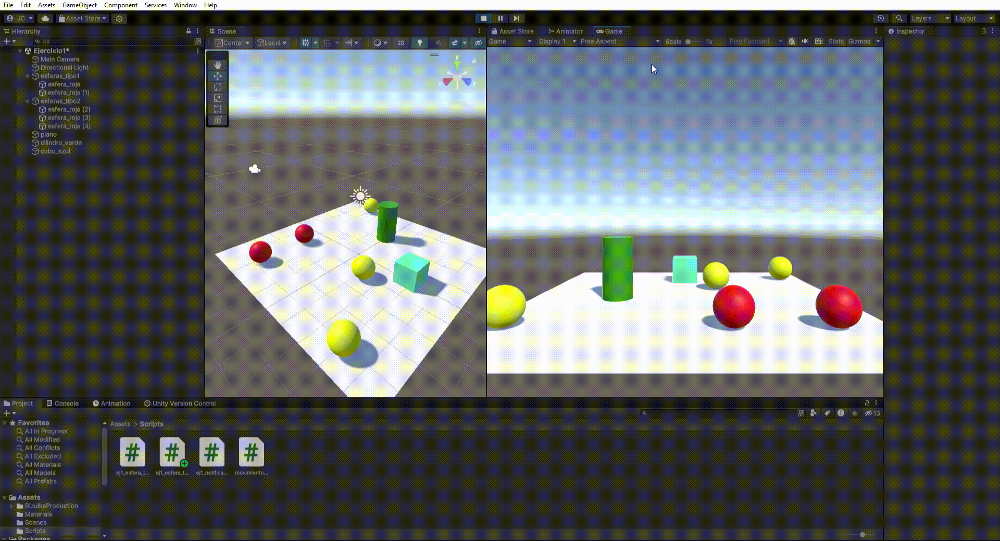
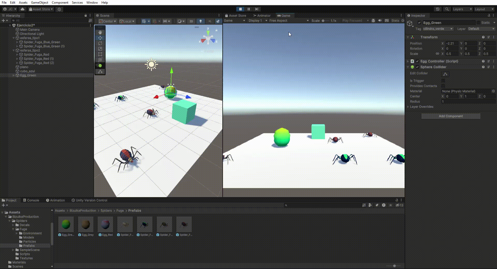
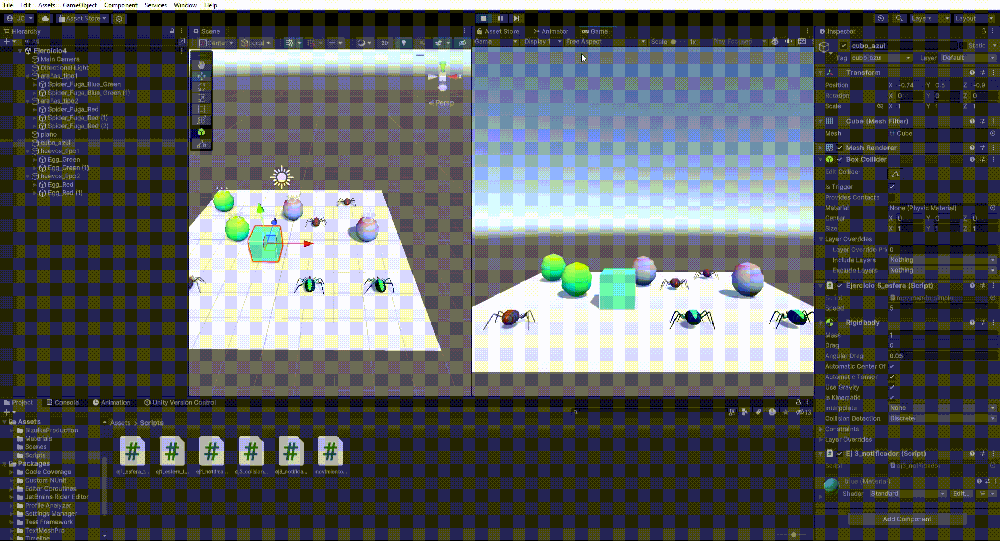
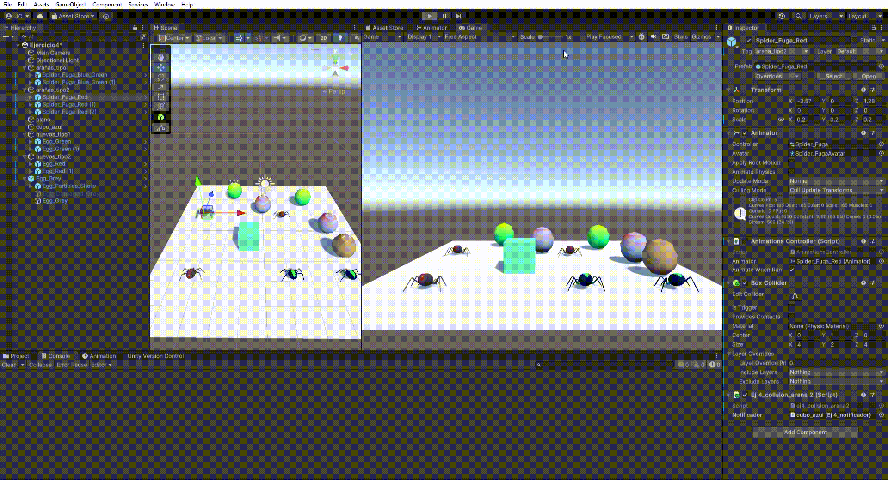

# P4: Delegados, Eventos

## 1
     
   Para detectar la colisión el cubo tiene un rigidbody cinemático. El cubo es un trigger y se emplea el evento OnTriggerEnter. Para que las esferas reaccionen a la colisión se emplea un script notificador que define un evento (función delegado) "OnCollision". Las esferas tienen un script suscriptor que tiene una referencia al notificador. Las de tipo 1 tienen un script y las de tipo 2 otro para que cada uan tenga el comportamiento deseado. Vemos como las esferas de tipo 1 persiguen a una de las de tipo2, que a su vez se desplaza hacia el cilindro.
## 2  
     
   Se sustituyen las esferas de tipo 1 por arañas zules, y las esferas de tipo 2 por arañas rojas. Se sustituye el cilindro por un huevo.
## 3
  
Cuando el cubo colisiona con cualquier araña de tipo 2, las arañas de tipo1 se acercan a un huevo de tipo1. Cuando el cubo toca cualquier araña de tipo 1, las arañas de tipo1 se dirigen a huevos del tipo2. Para cambiar el material de los huevos cuando colisiona una araña se accede al mesh renderer hijo del objeto de la colisión mediante "GetComponentInChildren" y se cambia el material a una copia con otro color. Se siguen unsando eventos y delegados para notificar a las arañas.
## 4
  
Se ha desactivado el script de animación de las arañas de tipo2 para que tras ejecutar la instrucción lookAt no cambien su rotación. Para el teletransporte se emplea el método translate acortando la distancia de movimiento una cantidad variable respecto al objetivo para que las arañas no se solapen dentro del huevo.
7. d
8. e
9. f
10. g
11. h
